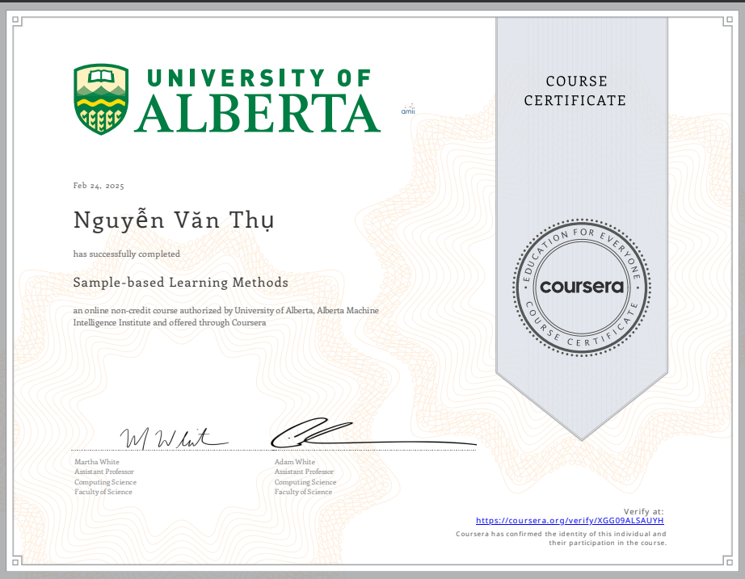

# 📜 README.md – Fundamentals of Reinforcement Learning Certificate  

## 🏆 Certificate: Fundamentals of Reinforcement Learning  
- **Place of issuance:** COURSERA  
- **Completion date:** February 16, 2025  

## 📖 Course Overview  
*Fundamentals of Reinforcement Learning* is a course that introduces statistical learning techniques in the field of Reinforcement Learning (RL), where an agent learns to interact with an environment by performing actions and receiving feedback (rewards).  

The course covers:  
✅ Fundamental concepts in RL: Agent, Environment, Reward, State, Action  
✅ Introduction to Markov Decision Processes (MDPs)  
✅ Monte Carlo methods and Temporal-Difference Learning  
✅ Explanation of Q-Learning and SARSA algorithms  

## 💡 Knowledge and Skills Acquired  
- Solid understanding of basic RL algorithms  
- Implementation of Monte Carlo, TD Learning, and Q-Learning algorithms in Python  
- Application of RL knowledge to solve automated decision-making problems  

## 📂 Certificate  
 

## 📝 Contact Information  
- 📧 Email: [nguyenvanthu958@gmail.com]  
