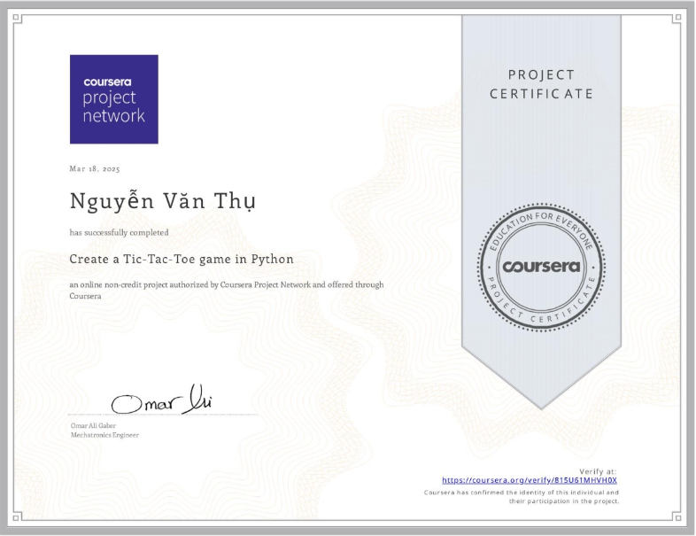
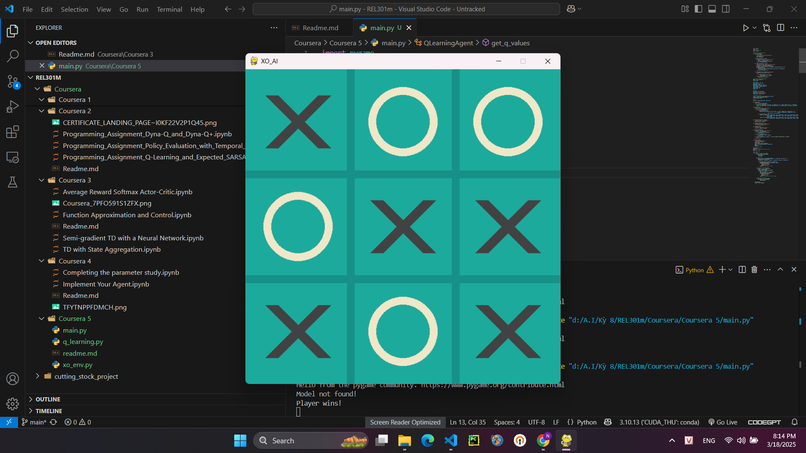

# Create a Tic-Tac-Toe game in Python
By the end of this guided-project you’ll be able to create a tic-tac-toe game in python using python’s popular library Pygame. Pygame is a set of python modules designed for writing video games. It allows you to create a fully featured game and multimedia programs in the python language. It’s also free, highly portable and runs on nearly every platform and operating system. 
You will learn about most of pygame’s functions and modules. You’ll be able to insert drawings and images into your game. You’ll be able to handle events and react to them being activated and finally, You’ll be able to take input from the user.

Note: This course works best for learners who are based in the North America region. We’re currently working on providing the same experience in other regions.

## 📂 Certificate  
 

## 📝 Running code:
 