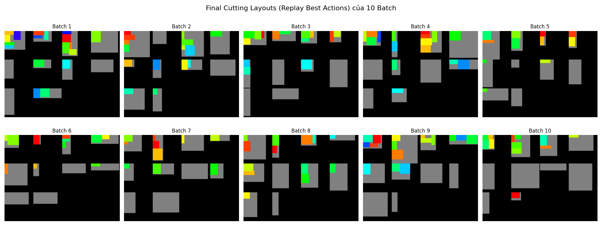

# 🧩 2D Cutting Stock Problem Solver (PPO, Q-Learning & Heuristic Approaches)

This repository presents a comprehensive solution to the **2D Cutting Stock Problem (2D-CSP)** using both **Reinforcement Learning** (PPO, Q-Learning) and **Heuristic algorithms**. The project focuses on optimizing material usage in industrial settings (e.g., glass, wood, metal cutting), reducing waste, and minimizing the number of stock sheets used.

---

## 📌 Problem Description

In manufacturing industries, large material sheets must be cut into smaller rectangles to meet demand. The challenge lies in:

- Reducing **total trim loss** (wasted material).
- Minimizing **number of stock sheets used**.
- Ensuring **feasible, non-overlapping placements**.

The project models this as a **2D-CSP** with strict constraints:
- Demand satisfaction.
- Material utilization within boundaries.
- No overlapping placements.
- Cut pieces must start from sheet edges.
- Fixed orientations (no rotation).

---

## 🧠 Approaches


### 1. 🧠 Reinforcement Learning - Q-Learning

In addition to PPO, we implemented a **Q-Learning** agent to compare value-based learning approaches in discrete action-state spaces.

#### 📌 Key Concepts

- **Q-table**: Stores expected rewards \( Q(s, a) \) for each state-action pair.
- **Epsilon-greedy** strategy for balancing exploration and exploitation.
- **Tabular updates** using Bellman Equation:

$$
Q(s, a) \leftarrow Q(s, a) + \alpha \left[ r + \gamma \max_{a'} Q(s', a') - Q(s, a) \right]
$$


#### 🔢 State Encoding

Simplified representation using:
- `empty_space`: Total available space.
- `remaining_products`: Remaining product quantity.

> Combined as: `state = (empty_space * 1000 + remaining_products) % state_size`

#### 🎮 Action Mapping

Each action is an index mapped to:
- Product index
- Cutting position (x, y)

Invalid actions are skipped or retried.

#### 🏆 Reward Strategy

| Reward Component         | Description                                              |
|--------------------------|----------------------------------------------------------|
| **Filled Ratio**         | Positive reward for high area usage                      |
| **Trim Loss**            | Penalized for unused space                               |
| **Unused Stock Bonus**   | Encourages fewer sheets used                             |
| **Final Completion Bonus** | Extra reward when task completed                        |

#### 📉 Limitations

- May lose spatial info in simple encoding.
- Less flexible in complex environments.
- Requires good hyperparameter tuning.

---


---

## 📊 Evaluation Metrics

| Metric               | Description                                               |
|----------------------|-----------------------------------------------------------|
| **Runtime (s)**       | Time taken for each approach                             |
| **Total Trim Loss**   | Sum of unused areas in used sheets                       |
| **Used Stocks**       | Number of sheets used to fulfill demand                  |
| **Remaining Stocks**  | Unused stock count                                       |
| **Avg Used Stock Area** | Avg area covered in each used sheet                    |

---

## 📈 Summary


| Method       | Trim Loss ↓             | Used Stocks ↓         | Speed ↑     | Learning Capability ↑ |
|--------------|--------------------------|------------------------|-------------|------------------------|
|
| **Q-Learning**  | ⚠️ Unstable (varies)    | ⚠️ Inconsistent        | ✅✅✅       | ✅✅                   |

---

## 🚀 Getting Started

### Install Dependencies
```bash
pip install -r requirements.txt
```


### Train Q-learning Agent
```bash
python training/train_q_learning.py
```


### Visualize Performance
```bash
python evaluation/evaluate.py
```

---
## 📚Results



---

## 👥 Authors

> **FPT University – Quy Nhon AI Campus**  
> Faculty of Information Technology – MINI Capstone Project – Mar 2025

- Nguyen Van Thu – QE170147  


**Instructor:** Dr. Nguyen An Khuong

---

## 📄 License

MIT License – See `LICENSE` for more details.
